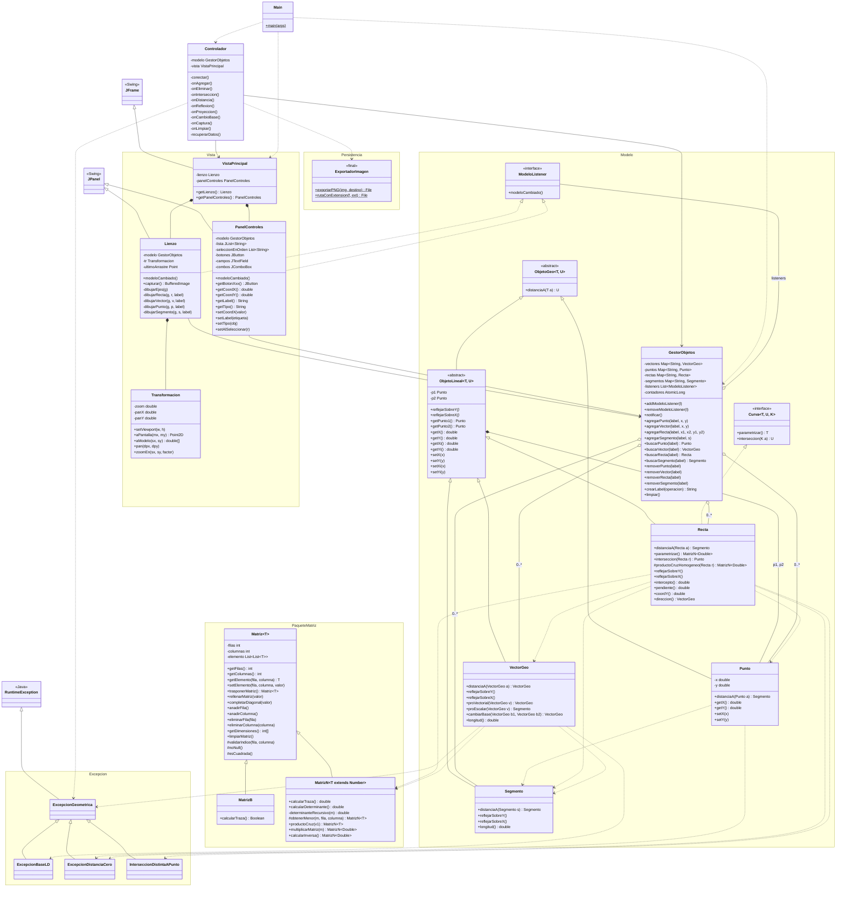

```mermaid
classDiagram
    direction TB

    namespace Modelo {
        class ModeloListener {
            <<interface>>
            +modeloCambiado()
        }

        class Curva~T, U, K~ {
            <<interface>>
            +parametrizar() T
            +interseccion(K a) U
        }

        class ObjetoGeo~T, U~ {
            <<abstract>>
            +distanciaA(T a) U
        }

        class ObjetoLineal~T, U~ {
            <<abstract>>
            -p1 Punto
            -p2 Punto
            +reflejarSobreY()*
            +reflejarSobreX()*
            +getPunto1() Punto
            +getPunto2() Punto
            +getX() double
            +getY() double
            +getXi() double
            +getYi() double
            +setX(x)
            +setY(y)
            +setXi(x)
            +setYi(y)
        }

        class Punto {
            -x double
            -y double
            +distanciaA(Punto a) Segmento
            +getX() double
            +getY() double
            +setX(x)
            +setY(y)
        }

        class Segmento {
            +distanciaA(Segmento s) Segmento
            +reflejarSobreY()
            +reflejarSobreX()
            +longitud() double
        }

        class VectorGeo {
            +distanciaA(VectorGeo a) VectorGeo
            +reflejarSobreY()
            +reflejarSobreX()
            +proVectorial(VectorGeo v) VectorGeo
            +proEscalar(VectorGeo v) Segmento
            +cambiarBase(VectorGeo b1, VectorGeo b2) VectorGeo
            +longitud() double
        }

        class Recta {
            +distanciaA(Recta a) Segmento
            +parametrizar() MatrizN~Double~
            +interseccion(Recta r) Punto
            #productoCruzHomogeneo(Recta r) MatrizN~Double~
            +reflejarSobreY()
            +reflejarSobreX()
            +intercepto() double
            +pendiente() double
            +coordY() double
            +direccion() VectorGeo
        }

        class GestorObjetos {
            -vectores Map~String, VectorGeo~
            -puntos Map~String, Punto~
            -rectas Map~String, Recta~
            -segmentos Map~String, Segmento~
            -listeners List~ModeloListener~
            -contadores AtomicLong
            +addModeloListener(l)
            +removeModeloListener(l)
            +notificar()
            +agregarPunto(label, x, y)
            +agregarVector(label, x, y)
            +agregarRecta(label, x1, x2, y1, y2)
            +agregarSegmento(label, s)
            +buscarPunto(label) Punto
            +buscarVector(label) VectorGeo
            +buscarRecta(label) Recta
            +buscarSegmento(label) Segmento
            +removerPunto(label)
            +removerVector(label)
            +removerRecta(label)
            +removerSegmento(label)
            +crearLabel(operacion) String
            +limpiar()
        }
    }

    namespace Excepcion {
        class ExcepcionGeometrica
        class ExcepcionBaseLD
        class ExcepcionDistanciaCero
        class InterseccionDistintaAPunto
    }

    namespace PaqueteMatriz {
        class Matriz~T~ {
            -filas int
            -columnas int
            -elemento List~List~T~~
            +getFilas() int
            +getColumnas() int
            +getElemento(fila, columna) T
            +setElemento(fila, columna, valor)
            +trasponerMatriz() Matriz~T~
            +rellenarMatriz(valor)
            +completarDiagonal(valor)
            +anadirFila()
            +anadirColumna()
            +eliminarFila(fila)
            +eliminarColumna(columna)
            +getDimensiones() int[]
            +limpiarMatriz()
            #validarIndice(fila, columna)
            #noNull()
            #esCuadrada()
        }

        class MatrizB {
            +calcularTraza() Boolean
        }

        class MatrizN~T extends Number~ {
            +calcularTraza() double
            +calcularDeterminante() double
            -determinanteRecursivo(m) double
            #obtenerMenor(m, fila, columna) MatrizN~T~
            +productoCruz(v1) MatrizN~T~
            +multiplicarMatriz(m) MatrizN~Double~
            +calcularInversa() MatrizN~Double~
        }
    }

    namespace Vista {
        class VistaPrincipal {
            -lienzo Lienzo
            -panelControles PanelControles
            +getLienzo() Lienzo
            +getPanelControles() PanelControles
        }

        class Lienzo {
            -modelo GestorObjetos
            -tr Transformacion
            -ultimoArrastre Point
            +modeloCambiado()
            +capturar() BufferedImage
            -dibujarEjes(g)
            -dibujarRecta(g, r, label)
            -dibujarVector(g, v, label)
            -dibujarPunto(g, p, label)
            -dibujarSegmento(g, s, label)
        }

        class PanelControles {
            -modelo GestorObjetos
            -lista JList~String~
            -seleccionEnOrden List~String~
            -botones JButton
            -campos JTextField
            -combos JComboBox
            +modeloCambiado()
            +getBotonXxx() JButton
            +getCoordX() double
            +getCoordY() double
            +getLabel() String
            +getTipo() String
            +setCoordX(valor)
            +setLabel(etiqueta)
            +setTipo(obj)
            +setAlSeleccionar(r)
        }

        class Transformacion {
            -zoom double
            -panX double
            -panY double
            +setViewport(w, h)
            +aPantalla(mx, my) Point2D
            +aModelo(sx, sy) double[]
            +pan(dpx, dpy)
            +zoomEn(sx, sy, factor)
        }
    }

    namespace Persistencia {
        class ExportadorImagen {
            <<final>>
            +exportarPNG(img, destino)$ File
            +rutaConExtension(f, ext)$ File
        }
    }

    class Controlador {
        -modelo GestorObjetos
        -vista VistaPrincipal
        -conectar()
        -onAgregar()
        -onEliminar()
        -onInterseccion()
        -onDistancia()
        -onReflexion()
        -onProyeccion()
        -onCambioBase()
        -onCaptura()
        -onLimpiar()
        -recuperarDatos()
    }

    class Main {
        +main(args)$
    }

    class RuntimeException {
        <<Java>>
    }
    class JFrame {
        <<Swing>>
    }
    class JPanel {
        <<Swing>>
    }

    %% Herencia
    ObjetoGeo <|-- ObjetoLineal
    ObjetoGeo <|-- Punto
    ObjetoLineal <|-- Segmento
    ObjetoLineal <|-- VectorGeo
    ObjetoLineal <|-- Recta
    Matriz <|-- MatrizN
    Matriz <|-- MatrizB
    RuntimeException <|-- ExcepcionGeometrica
    ExcepcionGeometrica <|-- ExcepcionBaseLD
    ExcepcionGeometrica <|-- ExcepcionDistanciaCero
    ExcepcionGeometrica <|-- InterseccionDistintaAPunto
    JFrame <|-- VistaPrincipal
    JPanel <|-- Lienzo
    JPanel <|-- PanelControles

    %% Realizacion de interfaces
    Curva <|.. Recta
    ModeloListener <|.. Lienzo
    ModeloListener <|.. PanelControles

    %% Composicion / agregacion
    ObjetoLineal *-- Punto : p1, p2
    VistaPrincipal *-- Lienzo
    VistaPrincipal *-- PanelControles
    Lienzo *-- Transformacion
    GestorObjetos o-- Punto : 0..*
    GestorObjetos o-- Recta : 0..*
    GestorObjetos o-- VectorGeo : 0..*
    GestorObjetos o-- Segmento : 0..*
    GestorObjetos o-- ModeloListener : listeners

    %% Asociaciones
    Lienzo --> GestorObjetos
    PanelControles --> GestorObjetos
    Controlador --> GestorObjetos
    Controlador --> VistaPrincipal

    %% Dependencias
    Punto ..> Segmento
    Recta ..> Segmento
    Recta ..> Punto
    Recta ..> VectorGeo
    VectorGeo ..> Segmento
    Recta ..> MatrizN
    VectorGeo ..> MatrizN
    Punto ..> ExcepcionDistanciaCero
    Recta ..> ExcepcionDistanciaCero
    Recta ..> InterseccionDistintaAPunto
    VectorGeo ..> ExcepcionBaseLD
    VectorGeo ..> ExcepcionGeometrica
    Controlador ..> ExportadorImagen
    Controlador ..> ExcepcionGeometrica
    Main ..> GestorObjetos
    Main ..> VistaPrincipal
    Main ..> Controlador

```
