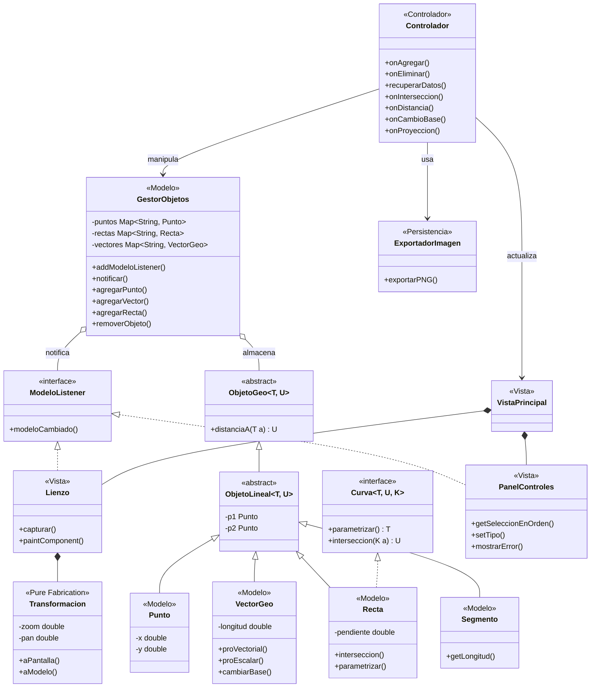

```mermaid
classDiagram
    direction TB

    %% ==========================================
    %% MODELO
    %% ==========================================
    class ModeloListener {
        <<interface>>
        +modeloCambiado()
    }

    class GestorObjetos {
        <<Modelo>>
        -puntos Map~String, Punto~
        -rectas Map~String, Recta~
        -vectores Map~String, VectorGeo~
        +addModeloListener()
        +notificar()
        +agregarPunto()
        +agregarVector()
        +agregarRecta()
        +removerObjeto()
    }

    class ObjetoGeo~T, U~ {
        <<abstract>>
        +distanciaA(T a) U
    }

    class ObjetoLineal~T, U~ {
        <<abstract>>
        -p1 Punto
        -p2 Punto
    }

    class Punto {
        <<Modelo>>
        -x double
        -y double
    }

    class VectorGeo {
        <<Modelo>>
        -longitud double
        +proVectorial()
        +proEscalar()
        +cambiarBase()
    }

    class Recta {
        <<Modelo>>
        -pendiente double
        +interseccion()
        +parametrizar()
    }

    class Segmento {
        <<Modelo>>
        +getLongitud()
    }

    class Curva~T, U, K~ {
        <<interface>>
        +parametrizar() T
        +interseccion(K a) U
    }

    %% ==========================================
    %% CONTROLADOR
    %% ==========================================
    class Controlador {
        <<Controlador>>
        +onAgregar()
        +onEliminar()
        +recuperarDatos()
        +onInterseccion()
        +onDistancia()
        +onCambioBase()
        +onProyeccion()
    }

    %% ==========================================
    %% VISTA
    %% ==========================================
    class VistaPrincipal {
        <<Vista>>
    }

    class Lienzo {
        <<Vista>>
        +capturar()
        +paintComponent()
    }

    class PanelControles {
        <<Vista>>
        +getSeleccionEnOrden()
        +setTipo()
        +mostrarError()
    }

    class Transformacion {
        <<Pure Fabrication>>
        -zoom double
        -pan double
        +aPantalla()
        +aModelo()
    }

    %% ==========================================
    %% PERSISTENCIA
    %% ==========================================
    class ExportadorImagen {
        <<Persistencia>>
        +exportarPNG()
    }

    %% ==========================================
    %% RELACIONES
    %% ==========================================

    %% Herencia y Polimorfismo
    ObjetoGeo <|-- ObjetoLineal
    ObjetoLineal <|-- Punto
    ObjetoLineal <|-- VectorGeo
    ObjetoLineal <|-- Recta
    ObjetoLineal <|-- Segmento

    %% Interfaces
    Curva <|.. Recta
    ModeloListener <|.. Lienzo
    ModeloListener <|.. PanelControles

    %% Dependencias
    GestorObjetos o-- ModeloListener : notifica
    GestorObjetos o-- ObjetoGeo : almacena

    Controlador --> GestorObjetos : manipula
    Controlador --> VistaPrincipal : actualiza
    Controlador --> ExportadorImagen : usa

    %% Composicion
    VistaPrincipal *-- Lienzo
    VistaPrincipal *-- PanelControles
    Lienzo *-- Transformacion
```
