# Diagramas de secuencia — «Geogebra-Clon»

> Observaciones
> - `notificar()` (Observer) recorre los `ModeloListener`: `Lienzo` repinta y `PanelControles` refresca la lista.
> - Las etiquetas de la lista llevan prefijo de tipo: `P:` punto, `V:` vector, `R:` recta, `S:` segmento.

---

## CU1 — Crear el lienzo

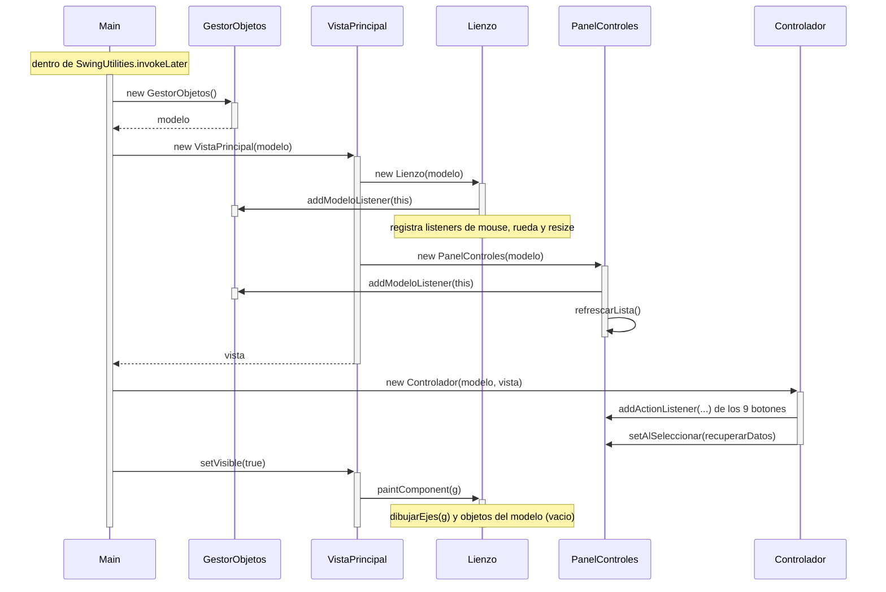
```mermaid
sequenceDiagram
    participant Main
    participant G as GestorObjetos
    participant VP as VistaPrincipal
    participant L as Lienzo
    participant PC as PanelControles
    participant C as Controlador

    Note over Main: dentro de SwingUtilities.invokeLater
    activate Main
    Main->>+G: new GestorObjetos()
    G-->>-Main: modelo
    Main->>+VP: new VistaPrincipal(modelo)
    VP->>+L: new Lienzo(modelo)
    L->>+G: addModeloListener(this)
    deactivate G
    Note over L: registra listeners de mouse, rueda y resize
    deactivate L
    VP->>+PC: new PanelControles(modelo)
    PC->>+G: addModeloListener(this)
    deactivate G
    PC->>PC: refrescarLista()
    deactivate PC
    VP-->>-Main: vista
    Main->>+C: new Controlador(modelo, vista)
    C->>PC: addActionListener(...) de los 9 botones
    C->>PC: setAlSeleccionar(recuperarDatos)
    deactivate C
    Main->>+VP: setVisible(true)
    VP->>+L: paintComponent(g)
    Note over L: dibujarEjes(g) y objetos del modelo (vacio)
    deactivate L
    deactivate VP
    deactivate Main
```

---

## CU2 — Agrandar o achicar el lienzo (zoom in/out)

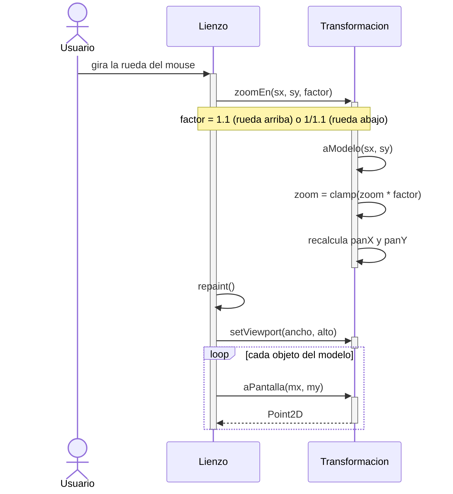
```mermaid
sequenceDiagram
    actor U as Usuario
    participant L as Lienzo
    participant T as Transformacion

    U->>+L: gira la rueda del mouse
    L->>+T: zoomEn(sx, sy, factor)
    Note over L,T: factor = 1.1 (rueda arriba) o 1/1.1 (rueda abajo)
    T->>T: aModelo(sx, sy)
    T->>T: zoom = clamp(zoom * factor)
    T->>T: recalcula panX y panY
    deactivate T
    L->>L: repaint()
    L->>+T: setViewport(ancho, alto)
    deactivate T
    loop cada objeto del modelo
        L->>+T: aPantalla(mx, my)
        T-->>-L: Point2D
    end
    deactivate L
```

---

## CU3 — Mover el lienzo (panning)

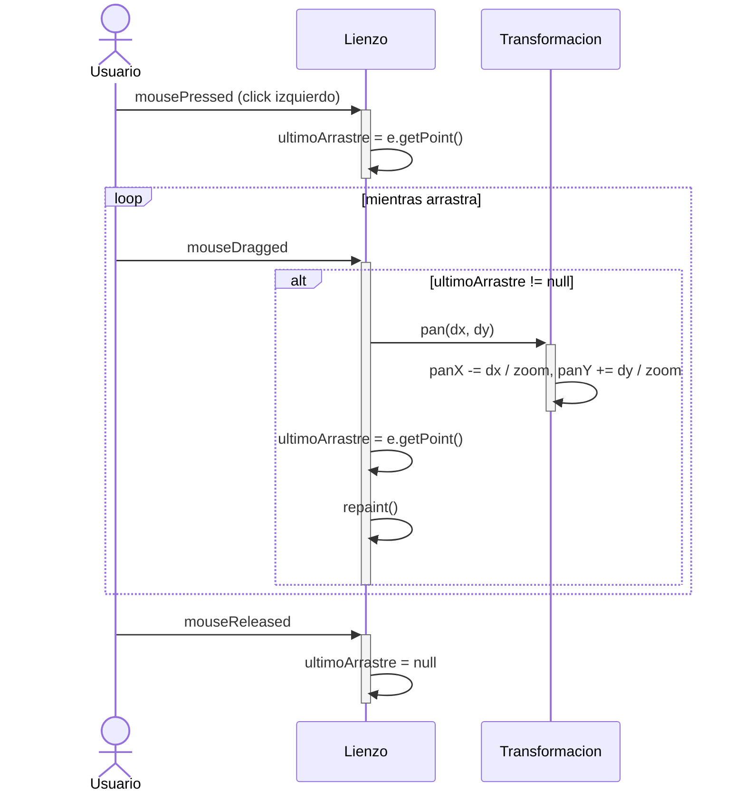
```mermaid
sequenceDiagram
    actor U as Usuario
    participant L as Lienzo
    participant T as Transformacion

    U->>+L: mousePressed (click izquierdo)
    L->>L: ultimoArrastre = e.getPoint()
    deactivate L
    loop mientras arrastra
        U->>+L: mouseDragged
        alt ultimoArrastre != null
            L->>+T: pan(dx, dy)
            T->>T: panX -= dx / zoom, panY += dy / zoom
            deactivate T
            L->>L: ultimoArrastre = e.getPoint()
            L->>L: repaint()
        end
        deactivate L
    end
    U->>+L: mouseReleased
    L->>L: ultimoArrastre = null
    deactivate L
```

---

## CU4 — Capturar el lienzo

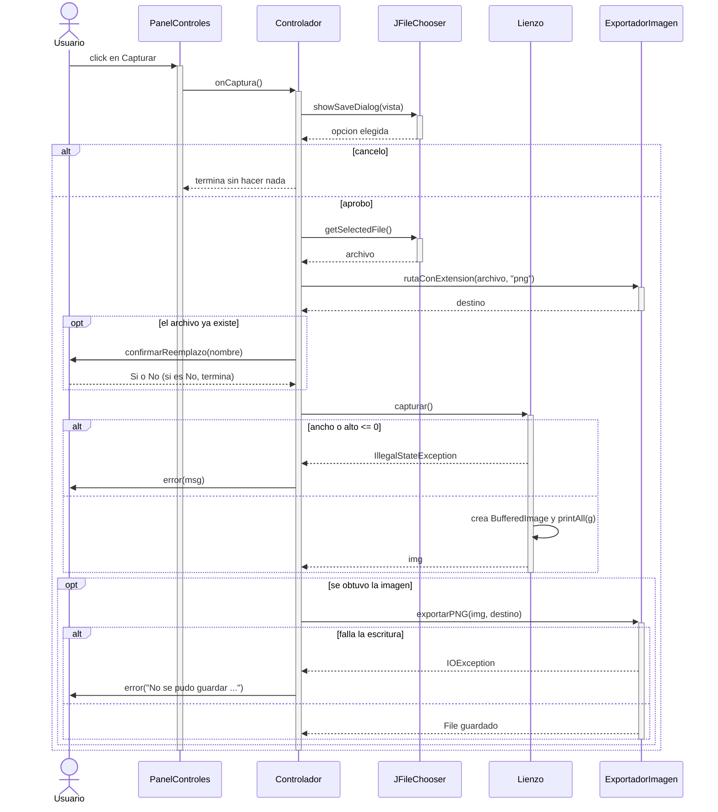
```mermaid
sequenceDiagram
    actor U as Usuario
    participant PC as PanelControles
    participant C as Controlador
    participant FC as JFileChooser
    participant L as Lienzo
    participant EI as ExportadorImagen

    U->>+PC: click en Capturar
    PC->>+C: onCaptura()
    C->>+FC: showSaveDialog(vista)
    FC-->>-C: opcion elegida
    alt cancelo
        C-->>PC: termina sin hacer nada
    else aprobo
        C->>+FC: getSelectedFile()
        FC-->>-C: archivo
        C->>+EI: rutaConExtension(archivo, "png")
        EI-->>-C: destino
        opt el archivo ya existe
            C->>U: confirmarReemplazo(nombre)
            U-->>C: Si o No (si es No, termina)
        end
        C->>+L: capturar()
        alt ancho o alto <= 0
            L-->>C: IllegalStateException
            C->>U: error(msg)
        else
            L->>L: crea BufferedImage y printAll(g)
            L-->>C: img
        end
        deactivate L
        opt se obtuvo la imagen
            C->>+EI: exportarPNG(img, destino)
            alt falla la escritura
                EI-->>C: IOException
                C->>U: error("No se pudo guardar ...")
            else
                EI-->>C: File guardado
            end
            deactivate EI
        end
    end
    deactivate C
    deactivate PC
```

---

## CU5 — Limpiar el lienzo

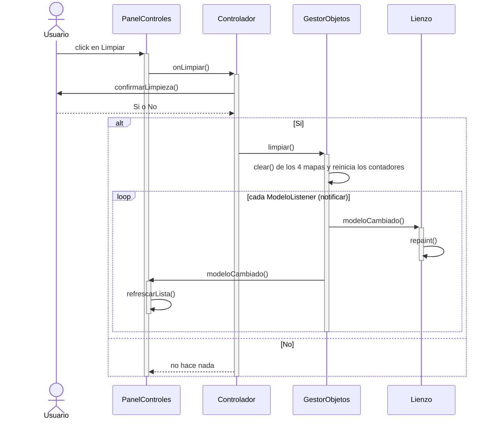
```mermaid
sequenceDiagram
    actor U as Usuario
    participant PC as PanelControles
    participant C as Controlador
    participant G as GestorObjetos
    participant L as Lienzo

    U->>+PC: click en Limpiar
    PC->>+C: onLimpiar()
    C->>U: confirmarLimpieza()
    U-->>C: Si o No
    alt Si
        C->>+G: limpiar()
        G->>G: clear() de los 4 mapas y reinicia los contadores
        loop cada ModeloListener (notificar)
            G->>+L: modeloCambiado()
            L->>L: repaint()
            deactivate L
            G->>+PC: modeloCambiado()
            PC->>PC: refrescarLista()
            deactivate PC
        end
        deactivate G
    else No
        C-->>PC: no hace nada
    end
    deactivate C
    deactivate PC
```

---

## CU6 — Dibujar objetos

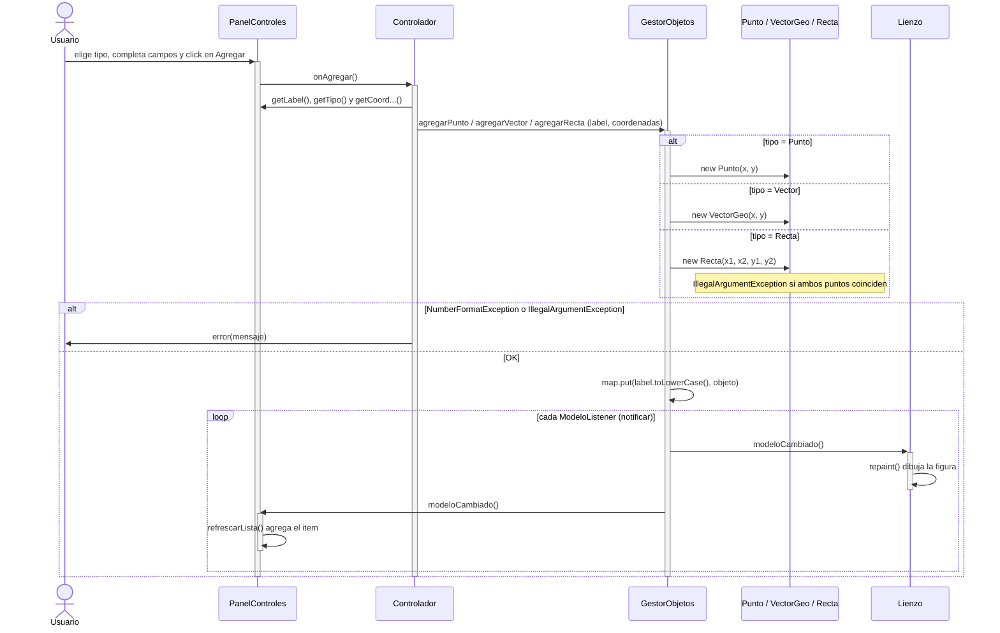
```mermaid
sequenceDiagram
    actor U as Usuario
    participant PC as PanelControles
    participant C as Controlador
    participant G as GestorObjetos
    participant M as Punto / VectorGeo / Recta
    participant L as Lienzo

    U->>+PC: elige tipo, completa campos y click en Agregar
    PC->>+C: onAgregar()
    C->>PC: getLabel(), getTipo() y getCoord...()
    C->>+G: agregarPunto / agregarVector / agregarRecta (label, coordenadas)
    alt tipo = Punto
        G->>M: new Punto(x, y)
    else tipo = Vector
        G->>M: new VectorGeo(x, y)
    else tipo = Recta
        G->>M: new Recta(x1, x2, y1, y2)
        Note over M: IllegalArgumentException si ambos puntos coinciden
    end
    alt NumberFormatException o IllegalArgumentException
        C->>U: error(mensaje)
    else OK
        G->>G: map.put(label.toLowerCase(), objeto)
        loop cada ModeloListener (notificar)
            G->>+L: modeloCambiado()
            L->>L: repaint() dibuja la figura
            deactivate L
            G->>+PC: modeloCambiado()
            PC->>PC: refrescarLista() agrega el item
            deactivate PC
        end
    end
    deactivate G
    deactivate C
    deactivate PC
```

---

## CU7 — Seleccionar objetos

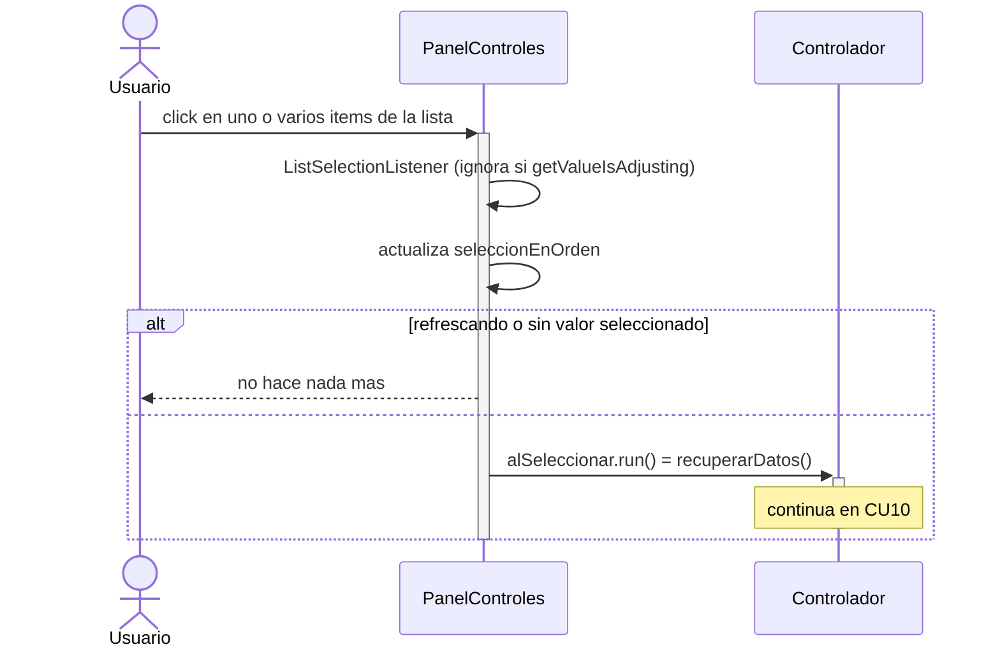
```mermaid
sequenceDiagram
    actor U as Usuario
    participant PC as PanelControles
    participant C as Controlador

    U->>+PC: click en uno o varios items de la lista
    PC->>PC: ListSelectionListener (ignora si getValueIsAdjusting)
    PC->>PC: actualiza seleccionEnOrden
    alt refrescando o sin valor seleccionado
        PC-->>U: no hace nada mas
    else
        PC->>+C: alSeleccionar.run() = recuperarDatos()
        Note over C: continua en CU10
        deactivate C
    end
    deactivate PC
```

---

## CU8 — Eliminar objetos

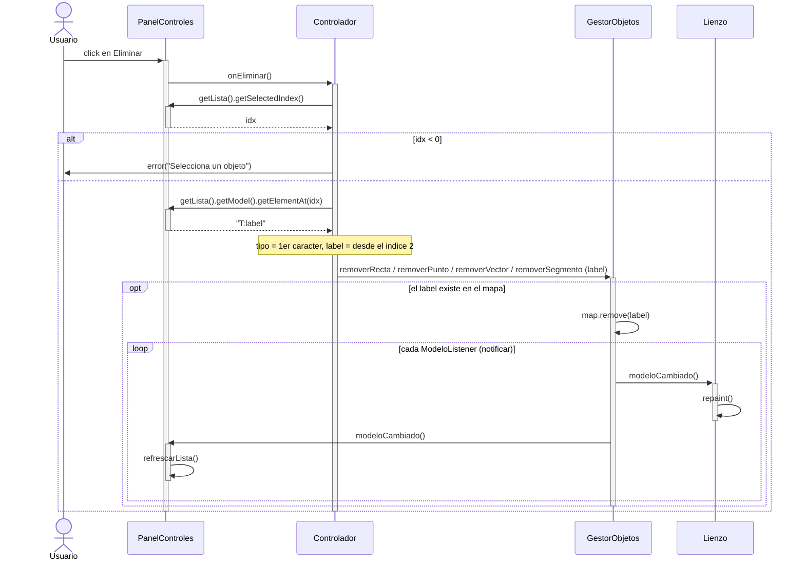
```mermaid
sequenceDiagram
    actor U as Usuario
    participant PC as PanelControles
    participant C as Controlador
    participant G as GestorObjetos
    participant L as Lienzo

    U->>+PC: click en Eliminar
    PC->>+C: onEliminar()
    C->>+PC: getLista().getSelectedIndex()
    PC-->>-C: idx
    alt idx < 0
        C->>U: error("Selecciona un objeto")
    else
        C->>+PC: getLista().getModel().getElementAt(idx)
        PC-->>-C: "T:label"
        Note over C: tipo = 1er caracter, label = desde el indice 2
        C->>+G: removerRecta / removerPunto / removerVector / removerSegmento (label)
        opt el label existe en el mapa
            G->>G: map.remove(label)
            loop cada ModeloListener (notificar)
                G->>+L: modeloCambiado()
                L->>L: repaint()
                deactivate L
                G->>+PC: modeloCambiado()
                PC->>PC: refrescarLista()
                deactivate PC
            end
        end
        deactivate G
    end
    deactivate C
    deactivate PC
```

---

## CU9 — Modificar objetos

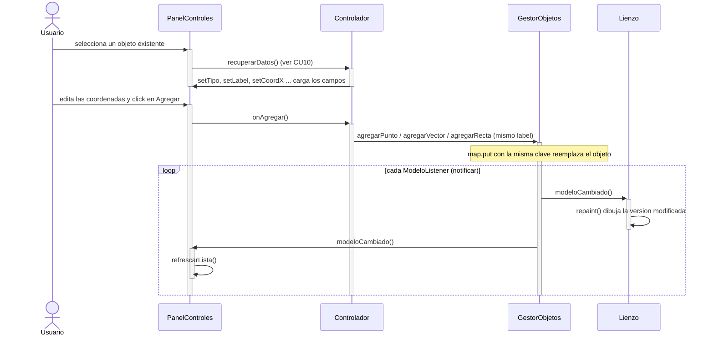
```mermaid
sequenceDiagram
    actor U as Usuario
    participant PC as PanelControles
    participant C as Controlador
    participant G as GestorObjetos
    participant L as Lienzo

    U->>+PC: selecciona un objeto existente
    PC->>+C: recuperarDatos() (ver CU10)
    C->>PC: setTipo, setLabel, setCoordX ... carga los campos
    deactivate C
    deactivate PC
    U->>+PC: edita las coordenadas y click en Agregar
    PC->>+C: onAgregar()
    C->>+G: agregarPunto / agregarVector / agregarRecta (mismo label)
    Note over G: map.put con la misma clave reemplaza el objeto
    loop cada ModeloListener (notificar)
        G->>+L: modeloCambiado()
        L->>L: repaint() dibuja la version modificada
        deactivate L
        G->>+PC: modeloCambiado()
        PC->>PC: refrescarLista()
        deactivate PC
    end
    deactivate G
    deactivate C
    deactivate PC
```

---

## CU10 — Recuperar la información del objeto

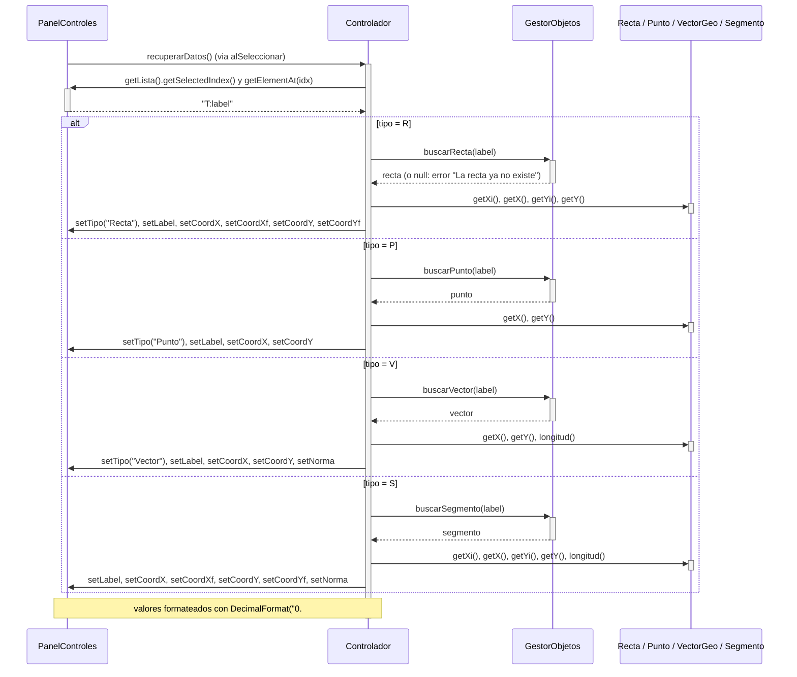
```mermaid
sequenceDiagram
    participant PC as PanelControles
    participant C as Controlador
    participant G as GestorObjetos
    participant O as Recta / Punto / VectorGeo / Segmento

    PC->>+C: recuperarDatos() (via alSeleccionar)
    C->>+PC: getLista().getSelectedIndex() y getElementAt(idx)
    PC-->>-C: "T:label"
    alt tipo = R
        C->>+G: buscarRecta(label)
        G-->>-C: recta (o null: error "La recta ya no existe")
        C->>+O: getXi(), getX(), getYi(), getY()
        deactivate O
        C->>PC: setTipo("Recta"), setLabel, setCoordX, setCoordXf, setCoordY, setCoordYf
    else tipo = P
        C->>+G: buscarPunto(label)
        G-->>-C: punto
        C->>+O: getX(), getY()
        deactivate O
        C->>PC: setTipo("Punto"), setLabel, setCoordX, setCoordY
    else tipo = V
        C->>+G: buscarVector(label)
        G-->>-C: vector
        C->>+O: getX(), getY(), longitud()
        deactivate O
        C->>PC: setTipo("Vector"), setLabel, setCoordX, setCoordY, setNorma
    else tipo = S
        C->>+G: buscarSegmento(label)
        G-->>-C: segmento
        C->>+O: getXi(), getX(), getYi(), getY(), longitud()
        deactivate O
        C->>PC: setLabel, setCoordX, setCoordXf, setCoordY, setCoordYf, setNorma
    end
    Note over C,PC: valores formateados con DecimalFormat("0.###")
    deactivate C
```

---

## CU11 — Dar la distancia entre objetos

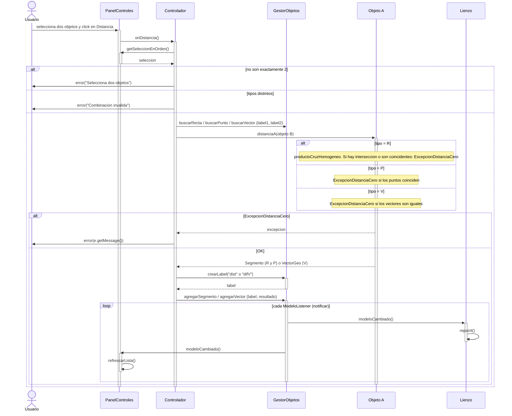
```mermaid
sequenceDiagram
    actor U as Usuario
    participant PC as PanelControles
    participant C as Controlador
    participant G as GestorObjetos
    participant A as Objeto A
    participant L as Lienzo

    U->>+PC: selecciona dos objetos y click en Distancia
    PC->>+C: onDistancia()
    C->>+PC: getSeleccionEnOrden()
    PC-->>-C: seleccion
    alt no son exactamente 2
        C->>U: error("Selecciona dos objetos")
    else tipos distintos
        C->>U: error("Combinacion invalida")
    else
        C->>G: buscarRecta / buscarPunto / buscarVector (label1, label2)
        C->>+A: distanciaA(objeto B)
        alt tipo = R
            Note over A: productoCruzHomogeneo. Si hay interseccion o son coincidentes: ExcepcionDistanciaCero
        else tipo = P
            Note over A: ExcepcionDistanciaCero si los puntos coinciden
        else tipo = V
            Note over A: ExcepcionDistanciaCero si los vectores son iguales
        end
        alt ExcepcionDistanciaCero
            A-->>C: excepcion
            C->>U: error(e.getMessage())
        else OK
            A-->>C: Segmento (R y P) o VectorGeo (V)
            C->>+G: crearLabel("dist" o "difV")
            G-->>-C: label
            C->>+G: agregarSegmento / agregarVector (label, resultado)
            loop cada ModeloListener (notificar)
                G->>+L: modeloCambiado()
                L->>L: repaint()
                deactivate L
                G->>+PC: modeloCambiado()
                PC->>PC: refrescarLista()
                deactivate PC
            end
            deactivate G
        end
        deactivate A
    end
    deactivate C
    deactivate PC
```

---

## CU12 — Transformar objetos (sólo reflexión)

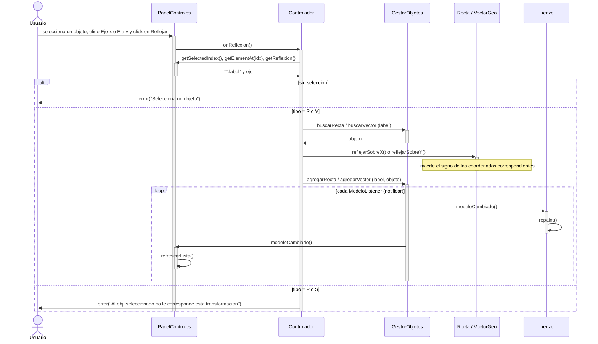
```mermaid
sequenceDiagram
    actor U as Usuario
    participant PC as PanelControles
    participant C as Controlador
    participant G as GestorObjetos
    participant O as Recta / VectorGeo
    participant L as Lienzo

    U->>+PC: selecciona un objeto, elige Eje-x o Eje-y y click en Reflejar
    PC->>+C: onReflexion()
    C->>+PC: getSelectedIndex(), getElementAt(idx), getReflexion()
    PC-->>-C: "T:label" y eje
    alt sin seleccion
        C->>U: error("Selecciona un objeto")
    else tipo = R o V
        C->>+G: buscarRecta / buscarVector (label)
        G-->>-C: objeto
        C->>+O: reflejarSobreX() o reflejarSobreY()
        Note over O: invierte el signo de las coordenadas correspondientes
        deactivate O
        C->>+G: agregarRecta / agregarVector (label, objeto)
        loop cada ModeloListener (notificar)
            G->>+L: modeloCambiado()
            L->>L: repaint()
            deactivate L
            G->>+PC: modeloCambiado()
            PC->>PC: refrescarLista()
            deactivate PC
        end
        deactivate G
    else tipo = P o S
        C->>U: error("Al obj. seleccionado no le corresponde esta transformacion")
    end
    deactivate C
    deactivate PC
```

---

## CU13 — Intersectar curvas (sólo rectas)

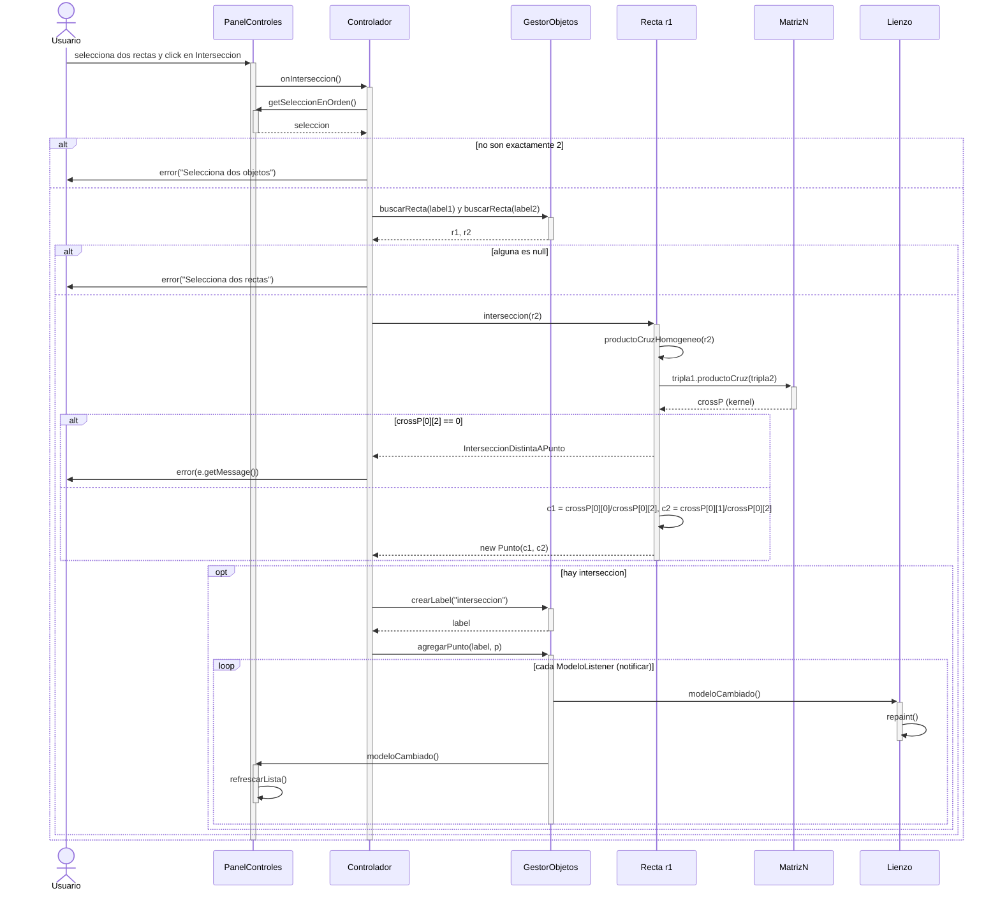
```mermaid
sequenceDiagram
    actor U as Usuario
    participant PC as PanelControles
    participant C as Controlador
    participant G as GestorObjetos
    participant R1 as Recta r1
    participant MN as MatrizN
    participant L as Lienzo

    U->>+PC: selecciona dos rectas y click en Interseccion
    PC->>+C: onInterseccion()
    C->>+PC: getSeleccionEnOrden()
    PC-->>-C: seleccion
    alt no son exactamente 2
        C->>U: error("Selecciona dos objetos")
    else
        C->>+G: buscarRecta(label1) y buscarRecta(label2)
        G-->>-C: r1, r2
        alt alguna es null
            C->>U: error("Selecciona dos rectas")
        else
            C->>+R1: interseccion(r2)
            R1->>R1: productoCruzHomogeneo(r2)
            R1->>+MN: tripla1.productoCruz(tripla2)
            MN-->>-R1: crossP (kernel)
            alt crossP[0][2] == 0
                R1-->>C: InterseccionDistintaAPunto
                C->>U: error(e.getMessage())
            else
                R1->>R1: c1 = crossP[0][0]/crossP[0][2], c2 = crossP[0][1]/crossP[0][2]
                R1-->>C: new Punto(c1, c2)
            end
            deactivate R1
            opt hay interseccion
                C->>+G: crearLabel("interseccion")
                G-->>-C: label
                C->>+G: agregarPunto(label, p)
                loop cada ModeloListener (notificar)
                    G->>+L: modeloCambiado()
                    L->>L: repaint()
                    deactivate L
                    G->>+PC: modeloCambiado()
                    PC->>PC: refrescarLista()
                    deactivate PC
                end
                deactivate G
            end
        end
    end
    deactivate C
    deactivate PC
```

---

## CU14 — Proyectar vectores

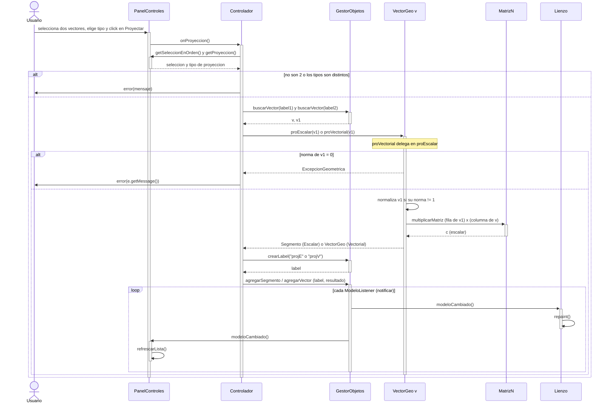
```mermaid
sequenceDiagram
    actor U as Usuario
    participant PC as PanelControles
    participant C as Controlador
    participant G as GestorObjetos
    participant V as VectorGeo v
    participant MN as MatrizN
    participant L as Lienzo

    U->>+PC: selecciona dos vectores, elige tipo y click en Proyectar
    PC->>+C: onProyeccion()
    C->>+PC: getSeleccionEnOrden() y getProyeccion()
    PC-->>-C: seleccion y tipo de proyeccion
    alt no son 2 o los tipos son distintos
        C->>U: error(mensaje)
    else
        C->>+G: buscarVector(label1) y buscarVector(label2)
        G-->>-C: v, v1
        C->>+V: proEscalar(v1) o proVectorial(v1)
        Note over V: proVectorial delega en proEscalar
        alt norma de v1 = 0
            V-->>C: ExcepcionGeometrica
            C->>U: error(e.getMessage())
        else
            V->>V: normaliza v1 si su norma != 1
            V->>+MN: multiplicarMatriz (fila de v1) x (columna de v)
            MN-->>-V: c (escalar)
            V-->>C: Segmento (Escalar) o VectorGeo (Vectorial)
            C->>+G: crearLabel("projE" o "projV")
            G-->>-C: label
            C->>+G: agregarSegmento / agregarVector (label, resultado)
            loop cada ModeloListener (notificar)
                G->>+L: modeloCambiado()
                L->>L: repaint()
                deactivate L
                G->>+PC: modeloCambiado()
                PC->>PC: refrescarLista()
                deactivate PC
            end
            deactivate G
        end
        deactivate V
    end
    deactivate C
    deactivate PC
```

---

## CU15 — Cambiar la base de un vector

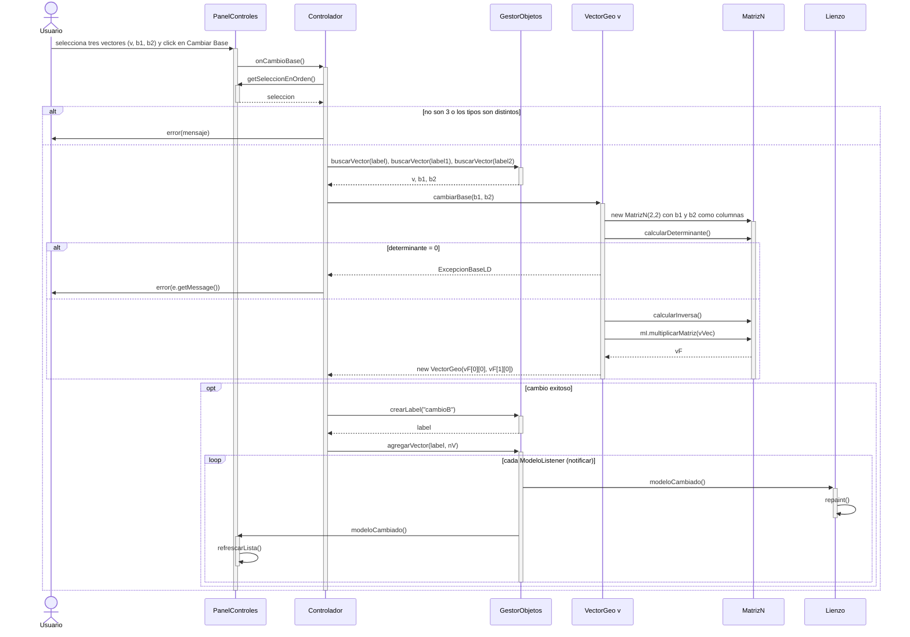
```mermaid
sequenceDiagram
    actor U as Usuario
    participant PC as PanelControles
    participant C as Controlador
    participant G as GestorObjetos
    participant V as VectorGeo v
    participant MN as MatrizN
    participant L as Lienzo

    U->>+PC: selecciona tres vectores (v, b1, b2) y click en Cambiar Base
    PC->>+C: onCambioBase()
    C->>+PC: getSeleccionEnOrden()
    PC-->>-C: seleccion
    alt no son 3 o los tipos son distintos
        C->>U: error(mensaje)
    else
        C->>+G: buscarVector(label), buscarVector(label1), buscarVector(label2)
        G-->>-C: v, b1, b2
        C->>+V: cambiarBase(b1, b2)
        V->>+MN: new MatrizN(2,2) con b1 y b2 como columnas
        V->>MN: calcularDeterminante()
        alt determinante = 0
            V-->>C: ExcepcionBaseLD
            C->>U: error(e.getMessage())
        else
            V->>MN: calcularInversa()
            V->>MN: mI.multiplicarMatriz(vVec)
            MN-->>V: vF
            V-->>C: new VectorGeo(vF[0][0], vF[1][0])
        end
        deactivate MN
        deactivate V
        opt cambio exitoso
            C->>+G: crearLabel("cambioB")
            G-->>-C: label
            C->>+G: agregarVector(label, nV)
            loop cada ModeloListener (notificar)
                G->>+L: modeloCambiado()
                L->>L: repaint()
                deactivate L
                G->>+PC: modeloCambiado()
                PC->>PC: refrescarLista()
                deactivate PC
            end
            deactivate G
        end
    end
    deactivate C
    deactivate PC
```
